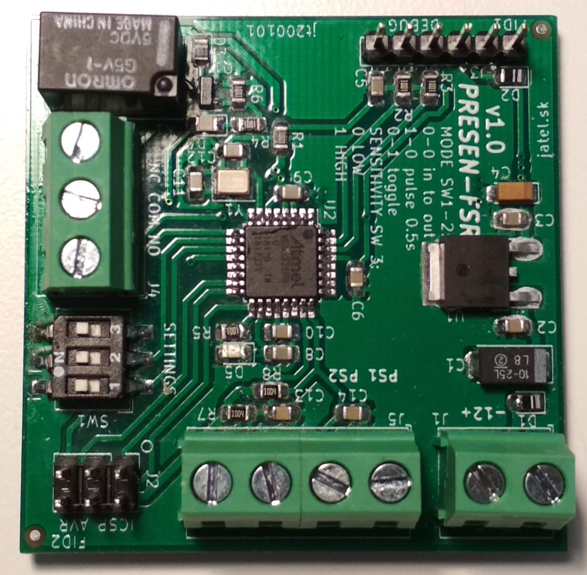

# PRESEN-FSR
## v1.0
###### jatel.sk

**Špecifikácia:**  
Napájanie: 12V DC / 50mA  
Vstupy: 2x analógové s pull-up rezistorom 1M  
Výstup: 1x prepínací kontakt 0,5A/125VAC  
Kryt: [KM-18B](https://www.tme.eu/sk/details/km-18b/skatulky-pre-poplasne-zariad-a-senzory/maszczyk/km-18b-bk/)  
Programátor: [CH340 Serial Port Debugger USB to TTL Converter](https://www.aliexpress.com/item/32645188490.html?spm=a2g0o.productlist.0.0.66445f43KrMtc2&algo_pvid=d437ea6a-45e1-45a2-b66c-f30d704bff8e&algo_expid=d437ea6a-45e1-45a2-b66c-f30d704bff8e-24&btsid=2100bdd816126106735653811e7d0a&ws_ab_test=searchweb0_0,searchweb201602_,searchweb201603_)

**Popis:**  
Elektronický modul pôvodne určený na pripojenie dvoch tlakových senzorov typu [FSR](https://www.conrad.sk/senzor-tlaku-fsr-408.k503372) od spoločnosti Interlink Electronics na dva analógové vstupy, ktoré mali byť umiestnené na schodisku ako spínač osvetlenia. Výstup je relátkový bezpotenciálový prepínací kontakt 0.5A/125VAC. Modul je kompatibilný s modulom Arduino nano 328, ale neobsahuje USB prevodník. Preto je potrebné použiť bežný Arduino USB [prevodník](https://www.aliexpress.com/item/32645188490.html?spm=a2g0o.productlist.0.0.66445f43KrMtc2&algo_pvid=d437ea6a-45e1-45a2-b66c-f30d704bff8e&algo_expid=d437ea6a-45e1-45a2-b66c-f30d704bff8e-24&btsid=2100bdd816126106735653811e7d0a&ws_ab_test=searchweb0_0,searchweb201602_,searchweb201603_). Modul obsahuje 3-pólový DIP spínač, ktorý je možné použiť na nastavenie rôznych režimov programu. Možnosti použitia sú samozrejme širšie. Napr. sa môže na vstup pripojiť tepelné čidlo DS18B20 a modul môže slúžiť  ako termostat. Prípadne loger nejakých meraných veličín ako napr. teplota, vlhkosť, tlak, prietok kvapaliny a pod. Hodnoty by sa po meraní mohli vyčítať cez sériový port pomocou USB prevodníku. Všetko záleží od firmwaru.

